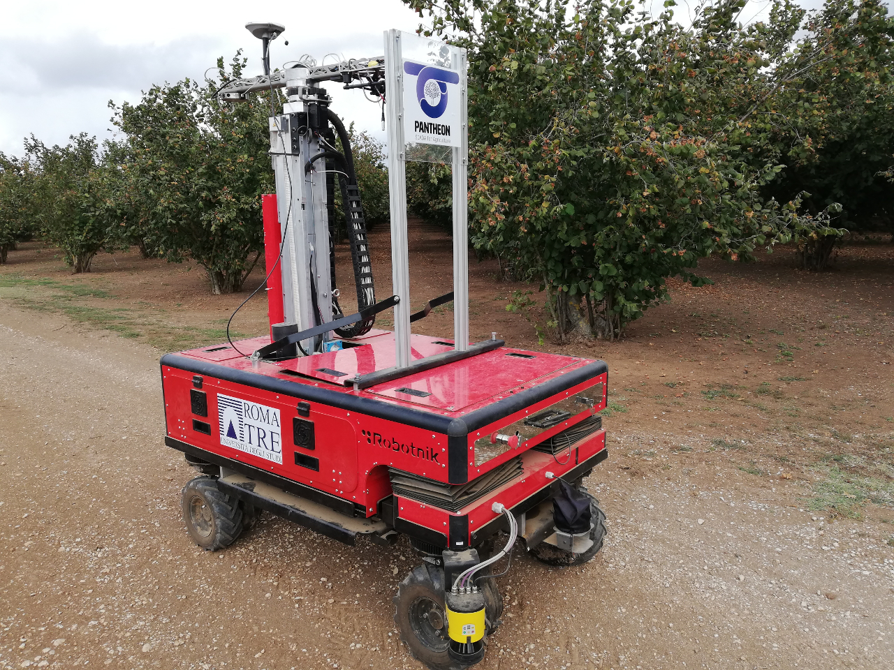

# A Navigation Architecture for Ackermann Vehicles in Precision Farming Package #



This software has been tested using Ubuntu 18.04 and Ros Melodic.

## Prerequisite: ACADO toolkit ##

```bash
git clone https://github.com/acado/acado.git -b stable ACADOtoolkit
cd ACADOtoolkit
mkdir build
cd build
cmake ..
make
sudo make install
echo "source <PATH_TO_ACADO_ROOT>/ACADOtoolkit/build/acado_env.sh" >> ~/.bashrc
```
where <ACADO_ROOT> is the absolute patg to the ACADOtoolkit folder.

## Installation ##

```bash
sudo apt-get install libyaml-cpp-dev libglfw3-dev python-catkin-tools ros-melodic-octomap-ros libgoogle-glog-dev libglew-dev libglm-dev
## Creating the workspace 
mkdir -p ~/sherpa_ws/src
cd ~/sherpa_ws/
catkin init 
cd src/
git clone https://github.com/project-pantheon/pantheon_planning_and_control.git && cd pantheon_planning_and_control
sh clone_dependencies.sh
catkin build
```

## Usage ##

```bash
roslaunch sherpa_ros sherpa_ros_ackermann.launch
```

## Credits ##

This code has been developed by the Roma Tre Research Unit within the context of the H2020 European Project PANTHEON (grant agreement number 774571).
Contacts:

Ciro Potena <ciro.potena@uniroma3.it><br>
Renzo Carpio <renzo.carpio@uniroma3.it><br>
Andrea Gasparri <gasparri@dia.uniroma3.it><br>

